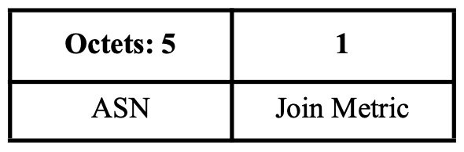
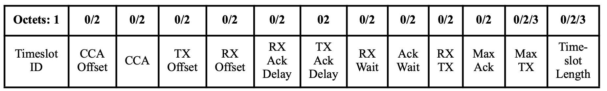
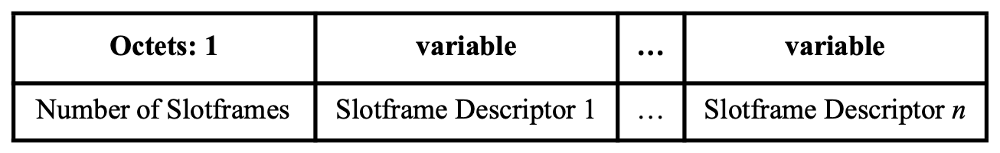
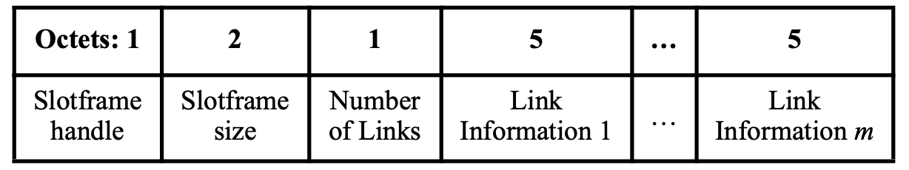
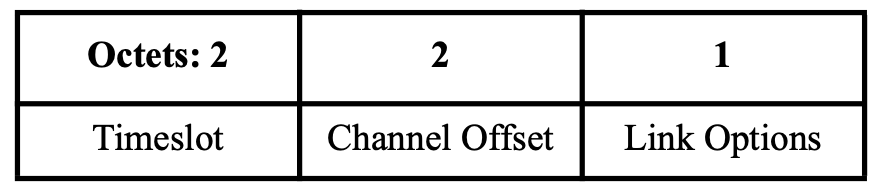
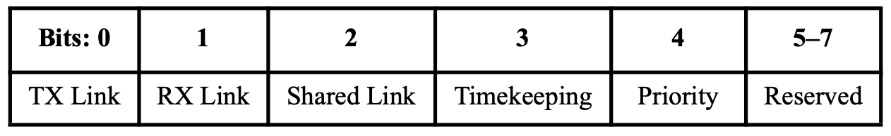
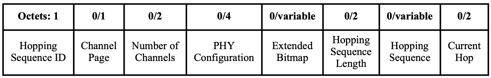
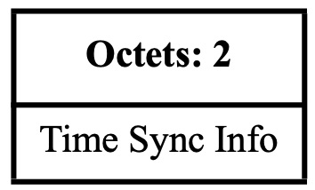
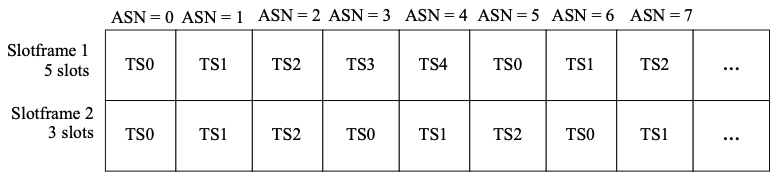
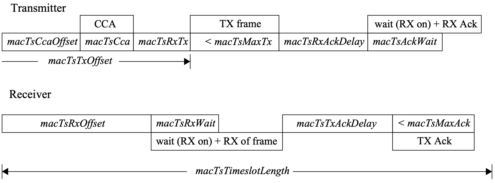

# TSCH-rs: an NLnet Project

TSCH-rs is a TSCH implementation written in Rust, providing ease-of-maintanance, security and reliability. Furthermore, the implementation aims to be hardware-agnostic, making it easy to port to different IEEE 802.15.4 based radios. The Rust network stack for IEEE 802.15.4 radios already contains an implementation for 6LoWPAN and RPL. TSCH-rs will be a valuable addition to the Rust based low-power IEEE 802.15.4 network stack.

> :warning: This document refers to version 802.15.4-2015 of the standard.

## Project Components

Contributions are made on two different Rust projects. 

* `dot15d4` :  This will be the IEEE 802.15.4 implementation written in Rust, initiated by Thibaut Vandervelden and available on [Github](https://github.com/thvdveld/dot15d4/tree/main/dot15d4). The library is designed to be used in embedded systems, and is `no_std` by default.
* `Embassy` : This is the [Rust framework](https://github.com/embassy-rs/embassy) for embedded applications that we will use for testing our `dot15d4` implementation on real hardware. It allows for writing safe, correct and energy-efficient embedded code faster, using the Rust programming language, its async facilities, and the Embassy libraries.

##### Cloning the project and its dependencies

In order to test our implementation and read the contributions made in the two Rust projects, you can recursively clone this repository :

 ```sh
 git clone --recursive https://github.com/jeremydub/TSCH-rs-milestones.git
 cd milestone1
 ```

 This will result in downloading the two dependencies at specific commits, created for this milestone.

# Milestone 1: Basic communication

The objective of the first milestone is to implement basic communication and frame parsing functionality, define slotframe structures, and manage ASN.

#### Checkpoints

1. Functionality to parse various TSCH packets/frames
    * Parsing of new frame and frame elements introduced by TSCH
    * the ability to correctly interpret and extract information from relevant types of packets/frames
2. TSCH Data Structures:
    * data structures for managing slotframes and timeslots should
    be defined;
    * data structures for managing neighbours and links should be
implemented/integrated
3. Study the timeslot timings and implement Absolute Slot Number (ASN) management
4. Interaction with lower layers: 
    * implement or integrate a low-level radio interface
5. Basic communication: 
    * ensure the ability to send and receive frames over the radio
6. Validate the parsing logic, the slotframe and ASN management with unit tests
7. Validate the basic communication on real hardware

# Checkpoints

In this section, we go over each checkpoint defined in the first milestone. For each checkpoint, we elaborate on what has to be implemented and we motivate the checkpoint completion.

## 1. Functionality to parse various TSCH packets/frames

We first identify the new frame and frame elements introduced by TSCH that we have to support in `dot15d4-frame`. Then, we validate the parsing of the new elements using `dot15d4-cat`, a CLI included in `dot15d4` that prints human-readable version of a packet.

### a) New frame and frame elements

The standard introduces new enhanced frames that are used in a TSCH Personal Area Network (PAN) :
* Enhanced-beacon : A beacon frame that may contain Header/Payload Information Elements (IEs);
* Enhanced-Acknowledgment : An acknowledgment frame that may contain Header Information Elements.

#### Enhanced-Beacon

As stated in Standard-6.3.6, in a TSCH PAN, the Enhanced Beacon frames contain the following new Information Elements:

* **TSCH Synchronization IE**, as described in Standard-7.4.4.2, containing timing information so new devices can synchronize to the network. The format of the Information Element is illustrated in the following figure :

<p align="center" width="100%">
    
</p>

<dl><dd><dl><dd>
Implementation of this Information Element can be found in the following files: 
<ul style="margin-left:2em;list-style-type: circle;">
    <li>Parsing from buffer : <code>dot15d4/dot15d4-frame/src/ie/nested.rs</code> (from <i>line 374</i>)
    <li>Emitting from structure to buffer : <code>dot15d4/dot15d4-frame/src/repr/ie/nested.rs</code> (from <i>line 119</i>)</li>
</ul>
</dd></dl></dd></dl>


* **TSCH Timeslot IE**, as described in Standard-7.4.4.4, containing timeslot information describing when to expect a frame to be transmitted and when to send an acknowledgment. The frame format is shown in the following figure :


<p align="center" width="100%">
    
</p>

<dl><dd><dl><dd>
Implementation of this Information Element can be found in the following files: 
<ul style="margin-left:2em;list-style-type: circle;">
    <li>Parsing from buffer : <code>dot15d4/dot15d4-frame/src/ie/nested.rs</code> (from <i>line 455</i>)</li>
<li>Emitting from structure to buffer : <code>dot15d4/dot15d4-frame/src/repr/ie/nested.rs</code> (from <i>line 359</i>)</li>
</ul>
</dd></dl></dd></dl>

* **TSCH Slotframe and Link IE**, as described in Standard-7.4.4.3, containing initial link and slotframe information so new devices know when to listen for transmissions from the advertising device and when they can transmit to the advertising device. The format of the Information Element is illustrated in the following figure :

<p align="center" width="100%">
    
</p>

<dl><dd><dl><dd>
This format refers to a <i>slotframe descriptor</i>, whose format is shown in the following figure:
</dd></dl></dd></dl>

<p align="center" width="100%">
    
</p>

<dl><dd><dl><dd>
A <i>Link Information</i> is formatted as following :
</dd></dl></dd></dl>

<p align="center" width="100%">
    
</p>

<dl><dd><dl><dd>
Finally, the <i>Link Options</i> field is a 1-byte field defined as the following :
</dd></dl></dd></dl>

<p align="center" width="100%">
    
</p>

<dl><dd><dl><dd>
Implementation of this Information Element and the different illustrated objects can be found in the following files: 
<ul style="margin-left:2em;list-style-type: circle;">
    <li>Parsing from buffer : <code>dot15d4/dot15d4-frame/src/ie/nested.rs</code> (from <i>line 916</i>)</li>
    <li>Emitting from structure to buffer : <code>dot15d4/dot15d4-frame/src/repr/ie/nested.rs</code> (from <i>line 151</i>)</li>
</ul>
</dd></dl></dd></dl>

* **Channel hopping IE**, as described in Standard-7.4.4.31, containing channel hopping information.

<p align="center" width="100%">
    
</p>

<dl><dd><dl><dd>
Implementation of this Information Element can be found in the following files: 
<ul style="margin-left:2em;list-style-type: circle;">
    <li>Parsing from buffer : <code>dot15d4/dot15d4-frame/src/ie/nested.rs</code> (from <i>line 1247</i>)
    <li>Emitting from structure to buffer : <code>dot15d4/dot15d4-frame/src/repr/ie/nested.rs</code> (from <i>line 439</i>)</li>
</ul>
</dd></dl></dd></dl>

#### Enhanced-Acknowledgment

In the context of TSCH, the receiving device can insert additional content in an acknowledgment frame using an Information Element, which result in the frame becoming an Enhanced-Acknowledgment.

More specifically, the Time Correction Information Element is inserted, which includes timing information used by nodes to maintain network synchronization.

This Time Correction Information element is composed of the Time Sync Info field which specifies time synchronization information and acknowledgment status. As shown in the following Figure, this field is constructed by taking a signed 16-bit twos-complement time correction in the range of -2048 µs to +2047 µs, AND’ing it with 0xfff, and OR’ing again with 0x8000 to indicate a negative acknowledgment.

<p align="center" width="100%">
    
</p>

<dl><dd><dl><dd>
Implementation of this Information Element can be found in the following files: 
<ul style="margin-left:2em;list-style-type: circle;">
    <li>Parsing from buffer : <code>dot15d4/dot15d4-frame/src/ie/headers.rs</code> (from <i>line 340</i>)</li>
    <li>Emitting from structure to buffer : <code>dot15d4/dot15d4-frame/src/repr/ie/headers.rs</code> (from <i>line 84</i>)</li>
</ul>
</dd></dl></dd></dl>

### b) Parsing Tool

A command-line tool has been developped to output human-readable version of a packet, based on the `dot15d4-frame` crate. Source code can be found in `dot15d4/dot15d4-cat/src`.

In order to test the tool, simply browse to the root of the `dot15d4` and compile/run the following binary crate :

```sh
cd dot15d4/
cargo run --bin dot15d4
```

You will need to provide a hexadecimal string, representing the packet to parse.

##### Parsing an Enhanced-Beacon packet

Running the parsing tool ont an Enhanced-Beacon as input :

```sh
cargo run --bin dot15d4 40ebcdabffff0100010001000100003f3788061a110000000000191c01080780004808fc032003e80398089001c0006009a010102701c8000f1b010011000200000100060100020007
```

outputs the following summary :

```sh 
Frame Control
  frame type: Enhanced Beacon
  security: 0
  frame pending: 0
  ack request: 0
  pan id compression: 1
  sequence number suppression: 1
  information elements present: 1
  dst addressing mode: Short
  src addressing mode: Extended
  frame version: 2 (Ieee802154_2020)
Addressing
  dst pan id: abcd
  dst addr: ff:ff (broadcast)
  src addr: 00:01:00:01:00:01:00:01
Information Elements
  Header Information Elements
    HeaderTermination1
  Payload Information Elements
    MLME
      TschSynchronization
        ASN: 17, join metric: 0
      TschTimeslot
        slot ID: 1
        cca_offset: 1.80ms
        cca: 0.13ms
        tx offset: 2.12ms
        rx offset: 1.02ms
        tx ack delay: 1.00ms
        rx ack delay: 0.80ms
        rx wait: 2.20ms
        ack wait: 0.40ms
        rx/tx: 0.19ms
        max ack: 2.40ms
        max tx: 4.26ms
        timeslot length: 10.00ms
      ChannelHopping
        sequence ID: 0
      TschSlotframeAndLink
        #slotframes: 1
        Slotframe Handle: 0, #links: 2
          Timeslot: 0, Channel Offset: 1, Link Options: Rx | Shared
          Timeslot: 1, Channel Offset: 2, Link Options: Tx | Rx | Shared

```

##### Parsing an Enhanced-Acknowledgment packet

Running the parsing tool on an Enhanced-Acknowledgment as input :

```sh
cargo run --bin dot15d4 022e37cdab0200020002000200020fe18f
```

outputs the following packet summary :

```sh
Frame Control
  frame type: Enhanced Ack
  security: 0
  frame pending: 0
  ack request: 0
  pan id compression: 0
  sequence number suppression: 0
  information elements present: 1
  dst addressing mode: Extended
  src addressing mode: Absent
  frame version: 2 (Ieee802154_2020)
Sequence Number
  sequence number: 55
Addressing
  dst pan id: abcd
  dst addr: 00:02:00:02:00:02:00:02
  src addr: absent
Information Elements
  Header Information Elements
    TimeCorrection
      -0.03ms, nack: 1
Payload
  []
```

## 2. TSCH Data Structures

### Slotframes & Timeslots

A slotframe is a collection of timeslots repeating in time. Each timeslot allows enough time for a pair of devices to exchange a frame and an acknowledgment. 

The number of timeslots in a given slotframe (slotframe size) determines how often each timeslot repeats, thus setting a communication schedule for nodes that use the timeslots. When a slotframe is created, it is associated with a slotframe handle, which is a 8-bit identifier, and a slotframe size (i.e. number of timeslots).

Each timeslot is an opportunity for a device to send or receive a single frame, and optionally
receive or transmit an acknowledgment to that frame.

A given network may contain several concurrent slotframes of different sizes as shown in the following figure :

<p align="center" width="100%">
    
</p>

The TSCH schedule will decide what communication to prioritize when timeslots overlap for a specific ASN (i.e. global time) in a multi-slotframe context.

The concepts and logic for managing a TSCH slotframe, a TSCH schedule, a timeslot communication are implemented in the following source file: 
<ul style="list-style-type: circle;">
    <li><code>dot15d4/dot15d4/src/mac/tsch/schedule.rs</code>
</ul>

### Neighbours and links

A TSCH link represents a communication within a timeslot and is caracterized by :

* a **handle**, which is a 16-bit link Identifier
* the associated **timeslot** in the slotframe
* the associated **channel offset** for the given timeslot for the link,
* The link communication **options** (TX / RX / Shared)
* the **type** of link (Normal / Advertisement)
* The **neighbor** assigned to the link for communication (may be shared link)

TSCH Link structure and management is implemented in the following source file: 
<ul style="list-style-type: circle;">
    <li><code>dot15d4/dot15d4/src/mac/tsch/schedule.rs</code> (from <i>line 17</i>)
</ul>

A table that store information about link-layer neighbours will be necessary to maintain a topology. This neighbours table will store the following neighbour state :

* The IEEE 8012.15.4 **address** of the neighbor.
* **Time of last transmission** of a packet by the neighbor.
* **Estimated transmission count** (ETX) necessary when communiting with the neighbor.
* **Link quality indicator** (LQI)
* Number of **transmissions** 
* Number of **packets received**

This information will be useful for a higher layer, such as routing, for selecting a best next-hop.

`dot15d4` does not provide an implementation for the table, only traits that need to be supported by the framework that uses our library. The traits are defined in the following source file: 
<ul style="list-style-type: circle;">
    <li><code>dot15d4/dot15d4/src/mac/neighbors.rs</code>
</ul>

## 3. Timeslot timings & Absolute Slot Number (ASN) management

### Timeslot timings

During a timeslot in a slotframe, one node typically sends a frame, and another sends back an Enhanced-Acknowledgment frame containing the Time Correction IE, as described in Standard-7.4.2.7. 

This synchronized communication is segmented into multiple phases, allowing for radios to switch from one state (RX/TX) to another. Thoses phases are guarded by time constants that are specific to the band in use. The following figure illustrates the different phases from the perspective of the sender and the receiver.


<p align="center" width="100%">
    
</p>

The constant used in the figure are listed in the following table :

| **Attribute**   | **Description**                                                                                                | **2450 MHz** | **915 MHz** |
|-----------------|----------------------------------------------------------------------------------------------------------------|---------------------------|----------------------------|
| CCA Offset      | The time between the beginning of timeslot and start of CCA operation, in µs.                                  | 1800                      | 1800                       |
| CCA             | Duration of CCA, in µs.                                                                                        | 128                       | 128                        |
| TX Offset       | The time between the beginning of the timeslot and the start of frame transmission, in µs.                     | 2120                      | 2800                       |
| Rx Offset       | Beginning of the timeslot to when the receiver shall be listening, in µs.                                      | 1020                      | 1800                       |
| RX Ack Delay    | End of frame to when the transmitter shall listen for acknowledgment, in µs.                                   | 800                       | 800                        |
| TX Ack Delay    | End of frame to start of acknowledgment, in µs.                                                                | 1000                      | 1000                       |
| RX Wait         | The time to wait for start of frame, in µs.                                                                    | 2200                      | 6000                       |
| RX TX           | Transmit to Receive turnaround, in µs.                                                                         | 192                       | 1000                       |
| Max Ack         | Transmission time to send an acknowledgment, in µs.                                                            | 2400                      | 6000                       |
| Max TX          | Transmission time to send the maximum length frame, in µs.                                                     | 4256                      | 103040                     |
| Timeslot Length | The total length of the timeslot including any unused time after frame transmission and acknowledgment, in µs. | 10000                     | 120000                     |
| Ack Wait        | The minimum time to wait for the start of an acknowledgment in µs.                                             | 400                       |                            |

Timeslot timings are implemented in the following source files: 
<ul style="margin-left:2em;list-style-type: circle;">
    <li><code>dot15d4/dot15d4-frame/src/ie/nested.rs</code> (from <i>line 455</i>)
    <li><code>dot15d4/dot15d4-frame/src/repr/ie/nested.rs</code> (from <i>line 359</i>)</li>
</ul>

### Absolute Slot Number

The total number of timeslots that has elapsed since the start of the network by the PAN coordinator is called the Absolute Slot Number (ASN). It increments globally in the network.

ASN structure and management is implemented in the following source file: 
<ul style="margin-left:2em;list-style-type: circle;">
    <li><code>dot15d4/dot15d4/src/mac/tsch/asn.rs</code>
</ul>

## 4. Interaction with lower layers

In `dot15d4`, the logic is separated in two distinct parts :

* `dot15d4/mac` : the MAC sublayer logic of 802.15.4
* `dot15d4/phy` : the PHY sublayer logic of 802.15.4

Each part defines a task that runs and communicate with each other via a  single-message channel for passing frames and commands.

The entry point for initializing of the MAC/PHY stack is found in :
<ul style="margin-left:2em;list-style-type: circle;">
    <li><code>dot15d4/dot15d4/src/lib.rs</code> (from <i>line 60</i>)
</ul>

#### MAC sublayer

`dot15d4/mac` defines two services that are specified in the standard :

* MAC Layer Management Entity (**MLME**) : This entity provides the service interfaces through which layer management may be invoked (by upper layer);
* MAC common part sublayer (**MCPS**) : This provides data service (sending/receiving frames).

These two services provide the interface between the next higher layer and the PHY sublayer. It receives MAC requests from higher layer and sends MAC indication to higher layer.

Source code related to the MAC sublayer is found in the following directory :
<ul style="margin-left:2em;list-style-type: circle;">
    <li><code>dot15d4/dot15d4/src/mac/</code>
</ul>

#### PHY sublayer

The PHY sublayer provides the interface between the radio medium and the MAC sublayer

Source code related to the PHY sublayer is found in the following directory :
<ul style="margin-left:2em;list-style-type: circle;">
    <li><code>dot15d4/dot15d4/src/phy/</code>
</ul>

`dot15d4` defines a Radio trait that needs to be implemented by a framework that uses our library. This trait defines the following methods :
* `disable`: Request the radio to idle to a low-power sleep mode.
* `enable` : Request the radio to wake from sleep.
* `prepare_receive`: Request the radio to go in receive mode and try to receive a frame into
* `receive` : Request the radio to go in receive mode and try to receive a frame.
* `prepare_transmit` : Request the radio to go in transmit mode and try to send a frame.
* `cancel_current_opperation` : When working with futures, it is not always guaranteed that a future will complete. This method must be seen as a notification to the radio where it can prepare for this cancelation
* `transmit` : Request the radio to transmit the queued frame.
* `ieee802154_address` : Returns the IEEE802.15.4 8-byte MAC address of the radio device.

This radio trait is found in the following file :
<ul style="margin-left:2em;list-style-type: circle;">
    <li><code>dot15d4/dot15d4/src/phy/radio/mod.rs</code>
</ul>

## 5. Basic communication

Testing our `dot15d4` implementation on real hardware requires a Framework that interfaces with our library and makes it easier to create an embedded application. *Embassy* Framework has been chosen for this project.

##### Radio Stack Driver

First we need to create a new driver in *Embassy* for our new 802.15.4 radio stack that will interface with `dot15d4`. This driver is not platform-dependent. It defines new traits that Embassy platforms will need to implement in order to use our driver.


The radio stack driver can be found in the following directory :
<ul style="margin-left:2em;list-style-type: circle;">
    <li><code>embassy/embassy-ieee802154/src/</code>
</ul>

##### Radio driver for NRF52840

For the purpose of this project, we support the NRF52840 platform (and its radio). It implements the new radio trait from `dot15d4`.

The radio driver is available in the following file :
<ul style="margin-left:2em;list-style-type: circle;">
    <li><code>embassy/embassy-nrf/src/radio/ieee802154.rs</code> (from <i>line 459</i>)
</ul>

## 6. Validation using Unit Tests

Unit tests can be found in the following source files :

* Absolute Slot Number management : ```dot15d4/dot15d4/src/mac/tsch/asn.rs```
* Slotframes and Links : ```dot15d4/dot15d4/src/mac/tsch/slotframe.rs```
* Frame Parsing tool ```dot15d4/dot15d4-cat/test/parser.rs```
* Frame Parsing ```dot15d4/dot15d4-frame/src/tests/parsing/{ack|beacon|data}.rs```
* Frame Generation ```dot15d4/dot15d4-frame/src/tests/mod.rs```


##### Running Unit Tests

```sh
cd dot15d4/
cargo test
```

## 7. Real Hardware validation

In order to validate our implementation on real hardware, we created a new Embassy application for Nrf52840 devices.

### Application

The application aims to show how to configure our new 802.15.4 stack in Embassy and how to send/receive frames via our stack. The scenario consists of one sender device and one receiver device. The first device sends a message to the receiver, every second, via a UDP socket, and the receiver echoes back the message to the source via the same UDP socket.

The application source file can be found here :

```sh
embassy/examples/nrf52840/src/bin/ieee802154-udp.rs
```

We created a variant of the first experiment that aims to show that our stack design, in combination with the asynchronous nature of `Embassy` and `dot15d4`, is able to handle a higher traffic rate, needed by TSCH. More specifically, sending one packet every 10 milliseconds (and receiving an acknowledgment during that period of time) should be possible, since it is the duration of a timeslot.

The source file of the variant can be found here :

```sh
embassy/examples/nrf52840/src/bin/ieee802154-udp-fast.rs
```

### Running the experiment

```sh
cd embassy/examples/nrf52840
```

You need two Nrf52840 devices connected to the computer.

**Node 1 (Sender)**

In one terminal, run the following command to compile & run the firmware on the first device :

```sh
ADDRESS=1 cargo run --release --bin ieee802154-udp
```

**Node 2 (Receiver)**

In a second terminal, run the following command to compile & run the firmware on the second device :

```sh
ADDRESS=2 cargo run --release --bin ieee802154-udp
```

**Experience Outputs**

From Receiver perspective :

```
0.000579        INFO     Network task initialized
0.000823        INFO     link_up = true
4.568969        INFO     Received Text : Hello, World !
4.569061        INFO     Echoing back message "Hello, World !"
5.085418        INFO     Received Text : Hello, World !
5.085510        INFO     Echoing back message "Hello, World !"
5.601867        INFO     Received Text : Hello, World !
5.601959        INFO     Echoing back message "Hello, World !"
6.118316        INFO     Received Text : Hello, World !
6.118408        INFO     Echoing back message "Hello, World !"
```
From Sender perspective :

```
0.000579	INFO 	Network task initialized
0.000793	INFO 	Sending message "Hello, World !"
0.001098	INFO 	link_up = true
0.026550	INFO 	Received Text Response : Hello, World !
0.526641	INFO 	Sending message "Hello, World !"
0.540069	INFO 	Received Text Response : Hello, World !
1.040130	INFO 	Sending message "Hello, World !"
1.053558	INFO 	Received Text Response : Hello, World !
1.553619	INFO 	Sending message "Hello, World !"
1.567047	INFO 	Received Text Response : Hello, World !
```

### Running the variant


In this variant, we disable the application serial log in order to mitigate the time induced by printing log (since we are in a cooperative context) and we set the sending period to 10 milliseconds.

**Node 1 (Sender)**

```sh
ADDRESS=1 cargo run --release --bin ieee802154-udp-fast
```

**Node 2 (Receiver)**

```sh
ADDRESS=2 cargo run --release --bin ieee802154-udp-fast
```

**Experience Output**

From the sender perspective, we can observe that it is able to send 1 packet exactly every 10 ms (i.e. 100 packets every second)

```
0.000640	INFO 	Network task initialized
0.001190	INFO 	link_up = true
1.000915	INFO 	Sent 100 packets
2.000915	INFO 	Sent 200 packets
3.000915	INFO 	Sent 300 packets
4.000915	INFO 	Sent 400 packets
5.000915	INFO 	Sent 500 packets
6.000915	INFO 	Sent 600 packets
7.000915	INFO 	Sent 700 packets
8.000915	INFO 	Sent 800 packets
9.000915	INFO 	Sent 900 packets
10.000915	INFO 	Sent 1000 packets
11.000915	INFO 	Sent 1100 packets
12.000915	INFO 	Sent 1200 packets
13.000915	INFO 	Sent 1300 packets
14.000915	INFO 	Sent 1400 packets
15.000915	INFO 	Sent 1500 packets
16.000915	INFO 	Sent 1600 packets
17.000915	INFO 	Sent 1700 packets
18.000915	INFO 	Sent 1800 packets
19.000915	INFO 	Sent 1900 packets
20.000915	INFO 	Sent 2000 packets
```

# About the project

This project was funded through the NGI0 Core Fund, a fund established by NLnet with financial support from the European Commission's Next Generation Internet programme, under the aegis of DG Communications Networks, Content and Technology under grant agreement No 101092990.
