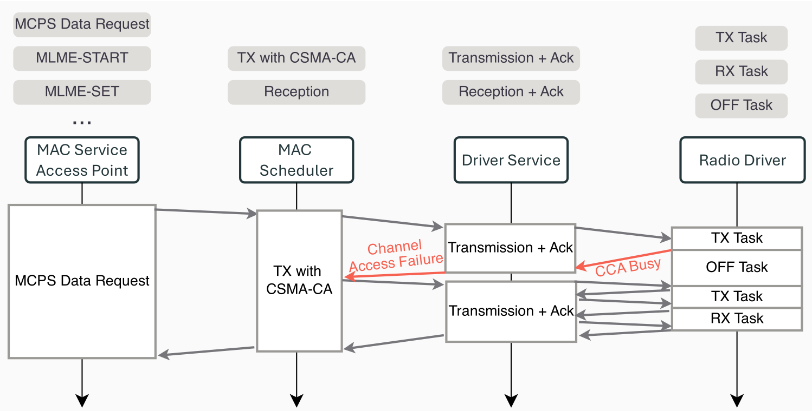
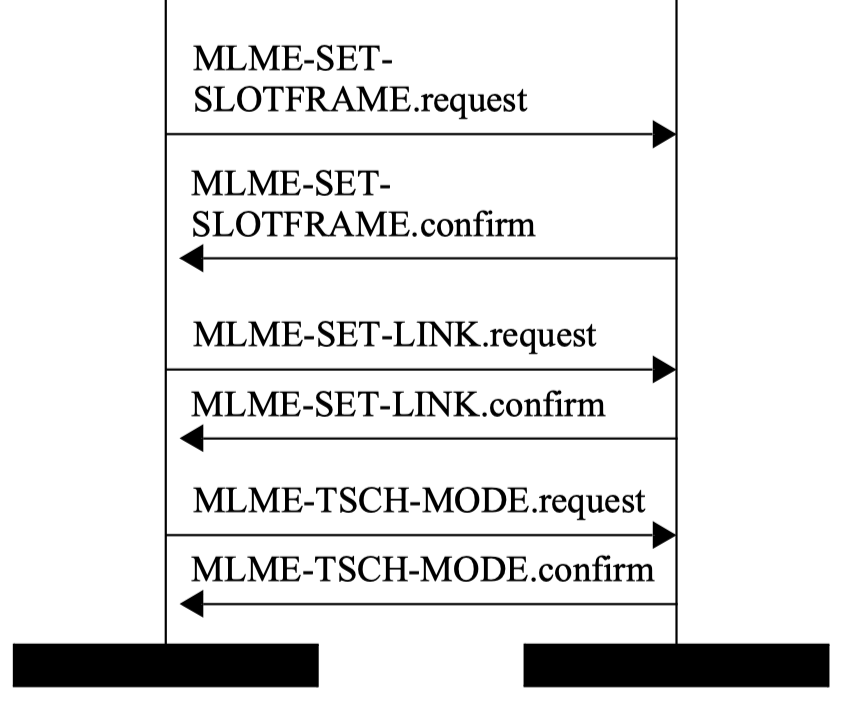

# TSCH-rs: an NLnet Project

TSCH-rs is a TSCH implementation written in Rust, providing ease-of-maintanance, security and reliability. Furthermore, the implementation aims to be hardware-agnostic, making it easy to port to different IEEE 802.15.4 based radios. The Rust network stack for IEEE 802.15.4 radios already contains an implementation for 6LoWPAN and RPL. TSCH-rs will be a valuable addition to the Rust based low-power IEEE 802.15.4 network stack.

## Project Components

Contributions are made on two different Rust projects. 

* `dot15d4` :  This will be the IEEE 802.15.4 implementation written in Rust, initiated by Thibaut Vandervelden and available on [Github](https://github.com/thvdveld/dot15d4/tree/main/dot15d4). The library is designed to be used in embedded systems, and is `no_std` by default.
* `Embassy` : This is the [Rust framework](https://github.com/embassy-rs/embassy) for embedded applications that we will use for testing our `dot15d4` implementation on real hardware. It allows for writing safe, correct and energy-efficient embedded code faster, using the Rust programming language, its async facilities, and the Embassy libraries.

# Milestone 2: Personal Area Network (PAN) Initialisation

**Objective:** Develop and validate the functionality for PAN initialisation in IEEE 802.15.4 TSCH networks.

This document details the implementation work completed for Milestone 2, covering the architecture of our layered network stack, Enhanced Beacon generation and transmission, testing methodology, and hardware validation.

#### Checkpoints

1. Implement the functionality to start as a PAN coordinator - triggered by the upper layer.
2. Develop the logic for generating and transmitting Enhanced Beacons (EBs)
3. Validate EB generation through unit and integration tests
4. Validate on real hardware 


#### Cloning the project and its dependencies

To test our implementation and read the contributions made in the two Rust projects, you can recursively clone this repository :

 ```sh
 git clone --recursive https://github.com/jeremydub/TSCH-rs-milestones.git
 cd milestone2
 ```

 This will result in downloading the main dependency at a specific commit, created for this milestone.

## 1. Implement the functionality to start as a PAN coordinator

### 1.1 Overview

Starting as a PAN coordinator requires a well-structured network stack where each service layer has clearly defined responsibilities and communicates through strongly-typed request/response interfaces. Our implementation follows a layered architecture that ensures clean separation of concerns: the upper layer does not need any knowledge of lower-layer implementation details, and vice versa.

The stack consists of four core services, each implemented with zero-copy message passing where possible:
- Radio Driver
- Driver Service
- Scheduler Service
- MAC Service

We briefly describe those services before detailing how to start a device as a TSCH PAN coordinator.

#### 1.1.1 Radio Driver

The Radio Driver provides hardware abstraction over the physical radio peripheral. It exposes a behaviorally-typed state machine interface that enforces correct radio operation sequences at compile time.

**Language (Request/Response):**
- `TX Task` : Transmit a frame at a specified timestamp with optional CCA
- `Rx Task` : Enable receiver with an allocated buffer for incoming frames, at a specified timestamp
- `Off Task` : Disable the radio to conserve power

**Location:** `dot15d4-driver` subcrate

#### 1.1.2 Driver Service

The Driver Service manages the radio driver lifecycle and provides a task-oriented interface to the scheduler. It handles radio state transitions, automatic acknowledgment transmission/reception and inter-frame spacing requirements.

The service provides the following primitives to the upper layer (i.e. Scheduler Service) 

*Driver Service Requests:*
- `Frame Transmission [at] [ACK]` : Transmit a frame at a specific timestamp (or best-effort) with optional ACK reception
- `Frame Reception [at] [ACK]` : Start listening at a specific timestamp (or best-effort) with optional ACK transmission
- `Idle` : Put radio in low-power mode

A request results in a stream of events in response :

*Stream Events:*
- `SentFrame` : Transmission completed
- `ReceivedFrame` : Frame received
- `Nack` : No acknowledgment received
- `TxStarted` : Transmission began
- `FrameStarted` : Incoming frame preamble detected
- `RxWindowEnded` : Reception timeout


**Location:** `dot15d4/src/driver.rs`

#### 1.1.3 Scheduler Service

The Scheduler Service implements medium access control scheduling. It currently supports two modes:
- **CSMA-CA:** Contention-based access for non-TSCH operation
- **TSCH:** Time-slotted channel hopping for deterministic, low-power operation

The service provides the following primitives to the upper layer (i.e. MAC Service) : 

*Scheduler Service Requests:*
- `Transmission` : Request to transmit an MPDU
- `Reception` : Request to receive incoming frames
- `Command` : Control commands (e.g., switch to TSCH mode)

The scheduler does not expose driver-level concepts; it operates purely in terms of MPDUs and scheduling policies.

**Location:** `dot15d4/src/scheduler/`

#### 1.1.4 MAC Service

The MAC Service implements IEEE 802.15.4 MAC layer primitives (MCPS and MLME services). It provides the interface used by upper-layer protocols/applications. It is able to handle multiple requests at a time asynchronously.

The service provides the following primitives : 

*MAC Service Requests:*
- `McpsData` : Data transmission request
- `MlmeTschMode` : Enable/disable TSCH mode
- `MlmeSetSlotframe` : Add/modify/delete a TSCH slotframe
- `MlmeSetLink` : Add/modify/delete a TSCH link
- `MlmeBeacon` : Beacon transmission request
- `MlmeSet` : PIB attribute modification
- ...

*MAC Confirmations:*
- `MacConfirm` : Operation completion with additional information such as completion timestamp

*MAC Indications:*
- `McpsDataIndication` : Received data frame
- `MlmeBeaconNotify` : Beacon received
- ...

**Location:** `dot15d4/src/mac/`

#### 1.1.5 Interactions

Services communicate through async channels. The following figure illustrates what happens when an upper layer requests a data frame to be sent.

<p align="center" width="90%">
    
</p>

### 1.2 Start as a PAN coordinator

To start as a TSCH PAN coordinator, a device shall first configure a TSCH schedule that will be used for network communications. The 802.15.4-2024 standard describes how a device may do so by sending well-defined MAC requests from the upper layer to the MAC Service access point. This exchange of requests is illustrated in the following figure showing upper layer communicating with MAC service.

<p align="center" width="100%">
    
</p>

The procedure is the following :

1. The device will add slotframe(s) to the TSCH schedule by sending `MLME-SET-SLOTFRAME` requests to the MAC service.
2. For each active link in each slotframe, an `MLME-SET-LINK` requests shall be submitted to add the link to the specified slotframe.
3. Once the schedule is complete, the upper-layer submit an `MLME-TSCH-MODE` request with parameter `tsch_mode = ON` for the MAC layer to operate using TSCH mode instead of CSMA-CA.

We implemented this procedure which translates to the following calls by the upper layer (i.e. the application)

1. Add a TSCH slotframe to the schedule :
```rust 
let mac_request = MacRequest::MlmeSetSlotframe(SetSlotframeRequest {
    handle: 0,      // Slotframe Identifier
    operation: ADD, // we want to add a slotframe
    size: 101,      // Size of the sloframe in timeslots
    advertise: true // The slotframe will be advertised in Enhanced Beacons
});
// The application holds the sender-side of the MAC request channel.
// We submit the request to the MAC service and wait for the operation to be completed
mac_request_sender
    .send_request_awaiting_response(request_token, mac_request)
    .await;
```

2. Add a link to a TSCH slotframe :
```rust 
let mac_request = MacRequest::MlmeSetLink(SetLinkRequest {
    handle: 0,           // Link Identifier
    slotframe_handle: 0, // handle of the associated slotframe
    operation: ADD,      // Operation: Add a slotframe
    channel_offset: 0,   // Channel offset used for the link
    timeslot: 0,         // Timeslot to use in the slotframe
    link_options: TX,    // Link used only for transmissions
    link_type: NORMAL,   // Used for data transmission and not for advertising
    advertise: true      // The link will be advertised in Enhanced Beacons
});
// We submit the request to the MAC service and wait for the operation to be completed
mac_request_sender
    .send_request_awaiting_response(request_token, mac_request)
    .await;
```

3. Switch to TSCH mode :
```rust 
let mac_request = MacRequest::MlmeTschMode(TschModeRequest {
    tsch_mode: true, // We want to enable TSCH mode
    tsch_cca: false, // No CCA shall be used within slot communication
});
// We submit the request to the MAC service and wait for the operation to be completed
mac_request_sender
    .send_request_awaiting_response(request_token, mac_request)
    .await;
```

The async call will return when the network has effectively switched to TSCH mode.


---

## 2. Logic for generating and transmitting Enhanced Beacons

We designed a simple TSCH scheduler that is able to handle advertising links, which is needed for transmitting Enhanced Beacons.

An Enhanced Beacon may be transmitted for different reasons :
- Upper layer request via `MLME-BEACON` request primitive from MAC service
- Periodic/keep-alive transmission from scheduler.

In our current implementation, we support both transmission mechanisms.

The scheduler manages a list of pending operations that are waiting for a valid timeslot to occur.

### 2.1 TSCH Scheduler running loop

When the upper layer request TSCH mode to be enabled, the scheduler starts its procedure :

1. The scheduler allocates and generate a first Enhanced Beacon based on the schedule built (via `MLME-SET-SLOTFRAME` and `MLME-SET-LINK`). This will populate the buffer with the different Information Elements needed for TSCH (i.e. TSCH schedule, TSCH Synchronization IE, TSCH Timeslot IE). 'Static' value won't need to be rebuilt, only dynamic values such as ASN will be changed.
2. The scheduler identifies the frame type as *Enhanced Beacon* and locates the next available advertising link in the schedule.
3. It calculates the next ASN for that link.
4. The scheduler adds that new operation to the queue of pending operations.
5. In the main loop, the scheduler retrieves the operation with earliest deadline.
6. The scheduler then translates the ASN in a precise instant and compute the channel on which the operation shall be performed.
7. The scheduler efficiently updates the relevant part of the buffer with the current schedule state (e.g., current ASN).
8. The scheduler submits a Transmission request to the lower-service, i.e. the driver service, which will be responsible for precisely send the frame (i.e. the Enhanced Beacon) at the specified instant.

### 2.2 Main files location

**Scheduling and Transmission: (`dot15d4` sub-crate)** 
- `dot15d4/src/scheduler/tsch/mod.rs` : TSCH Scheduler Running loop
- `dot15d4/src/scheduler/tsch/schedule.rs` : `TschSchedule`, `TschSlotframe`, `TschLink`
- `dot15d4/src/scheduler/tsch/runner.rs` : `TschRunner`, `TschOperation`, ASN computation
- `dot15d4/src/scheduler/tsch/beacon.rs` : Enhanced-beacon generation from schedule
- `dot15d4/src/scheduler/tsch/asn.rs` : `AbsoluteSlotNumber` type and operations

**Enhanced beacon IE Implementation (`dot15d4-driver` sub-crate):**
- `dot15d4-driver/src/radio/frame/ies/mod.rs` : IE parsing, iteration, and header initialisation
- `dot15d4-driver/src/radio/frame/ies/header.rs` : Header IE structures (`HeaderIeHeader`, `TimeCorrectionIe`)
- `dot15d4-driver/src/radio/frame/ies/payload.rs` : Payload IE structures (`PayloadIeHeader`, MLME container)
- `dot15d4-driver/src/radio/frame/ies/nested.rs` : Nested IE structures:
  - `TschSyncIe` : TSCH Synchronisation IE
  - `TschTimeslotIe` : TSCH Timeslot IE (reduced and full formats)
  - `TschSlotframeLinkIe` : Slotframe and Link IE
  - `ChannelHoppingIe` : Channel Hopping IE
  - `LinkDescriptor`, `SlotframeDescriptor` : Sub-structures for link/slotframe iteration

**Frame Parsing and Construction (`dot15d4-frame` sub-crate):**
- `dot15d4-frame/src/mpdu.rs` : MPDU frame structure and accessors
- `dot15d4-frame/src/repr/` : Compile-time frame representation (`MpduRepr`)
- `dot15d4-frame/src/fields/ies/tsch.rs` : TSCH-specific IE field definitions

---

## 3. Unit and Integration Tests

Our test suite validates Enhanced Beacon generation, Information Elements parsing, frame construction, and protocol logic through unit tests distributed across the crates.

### 3.1 Tests Coverage

* **Nested Information Elements** (`dot15d4-driver/src/radio/frame/ies/nested.rs`)\
Number of tests : 24

* **Header Information Elements**\
Location : `dot15d4-driver/src/radio/frame/ies/header.rs` \
Number of tests : 18

* **Payload Information Elements**\
Location : `dot15d4-driver/src/radio/frame/ies/payload.rs`\
Number of tests : 5

* **Schedule Tests**\
Location : `dot15d4/src/scheduler/tsch/schedule.rs`\
Number of tests : 3

* **IE Iteration Tests**\
Location : `dot15d4-driver/src/radio/frame/ies/mod.rs`\
Number of tests : 2

### 3.2 Running Tests

```bash
# Navigate to Milestone 2's folder
cd milestone-2/

# Go into dot15d4 project
cd dot15d4/

# Run all tests in the workspace
cargo test --workspace

# Run IE-specific tests
cargo test --package dot15d4-driver -- ies

# Run TSCH scheduler tests
cargo test --package dot15d4 -- tsch

# Run with output for debugging
cargo test --workspace -- --nocapture
```

---

## 4. Hardware Validation

The `tsch-coordinator.rs` example application demonstrates end-to-end PAN initialisation and Enhanced Beacon transmission on real hardware (Nordic nRF52840).

**File Location:** `examples/nrf52840/src/bin/tsch-coordinator.rs`

### 4.1 Application Purpose

The application is a simple upper layer application that configures the device as a TSCH coordinator by creating a simple TSCH schedule containing a single slotframe of size 100 with timeslot of length 10ms (i.e. slotframe repeats exactly every second). A single link inside of this TSCH schedule is configured on timeslot 0 to send advertising frames, i.e. Enhanced Beacons.

The application instantiates all four service layers described earlier. Four Embassy tasks run concurrently:
1. `driver_service_task` : Radio hardware management
2. `scheduler_service_task` : TSCH scheduling
3. `mac_service_task` : MAC Service for MAC requests handling
4. `upper_layer_task` : Application logic (PAN coordinator)

The upper layer task is quite straight-forward since it simply initializes the TSCH procedure and waits indefinitely:

```rust 
async fn upper_layer_task(
    _timer: NrfRadioSleepTimer,
    buffer_allocator: MacBufferAllocator,
    request_sender: MacRequestSender<'static>,
    mac_indication_receiver: MacIndicationReceiver<'static>,
) -> ! {
    info!("Start as TSCH coordinator");
    start_tsch(&request_sender).await;
    pending().await
}
```

The `start_tsch()` function call submits several MAC service requests to configure the TSCH schedule and switch to TSCH mode, as already explained in *Section 1.2*.

We expect the upper layer to be 'idle' while the Scheduler will indefinitely transmit an Enhanced beacon every slotframe at timeslot 0. Enhanced beacon should contains the different Information Elements required for TSCH. The observed ASN should be set accordingly for every new beacon sent.

### 4.3 Validation

**Compiling/flashing the firmware:**

```bash
# Go to dot15d4 project folder
cd milestone-2/dot15d4

# Go to examples for nRF52840
cd examples/nrf52840

# Build/Flash PAN coordinator example to connected nRF52840 device
cargo embed --bin tsch-coordinator --release --features defmt flash
```

**Connect to the debug interface:**

```bash
cargo embed --bin tsch-coordinator --release --features defmt rtt
```

**Device Output:**

```
INFO  Start as client
INFO  TSCH started
```

**Radio trace:**

To observe the radio traffic, you need a sniffer device. You can follow the instructions for the Nordic Sniffer for nRF52840 to configure it as a Wireshark sniffer. :

- [nRF Sniffer for 802.15.4 Firmware](https://github.com/NordicSemiconductor/nRF-Sniffer-for-802.15.4)

We recorded a 100-seconds radio trace of the coordinator application running, using Wireshark. This trace is available in the repository at file :
- [/milestone2/tsch-coordinator.pcapng](/milestone2/tsch-coordinator.pcapng)

The following screenshot highlights the expected behavior of the application :
1) We observe precise enhanced Beacon transmission every 100 timeslots, i.e. every second.
2) When inspecting an Enhanced Beacon packet, we can validate that the expected TSCH related IEs are present and the ASN is updated accordingly for each new Enhanced beacon (i.e. `ASN+=100` every beacon)

<p align="center" width="100%">
    
</p>

The hardware validation confirms :

1. **Service Layer Integration:** All four services start successfully and communicate through their respective communication channels
2. **TSCH Mode Activation:** The `MlmeTschMode` request transitions the scheduler from CSMA-CA to TSCH mode
3. **Enhanced Beacon Transmission:** Beacons are transmitted on advertising links at scheduled ASN boundaries
4. **IE Population:** All TSCH Information Elements are correctly encoded in the transmitted frames
5. **Timing Accuracy:** Transmission timestamps are captured and logged.


# About the project

This project was funded through the NGI0 Core Fund, a fund established by NLnet with financial support from the European Commission's Next Generation Internet programme, under the aegis of DG Communications Networks, Content and Technology under grant agreement No 101092990.
