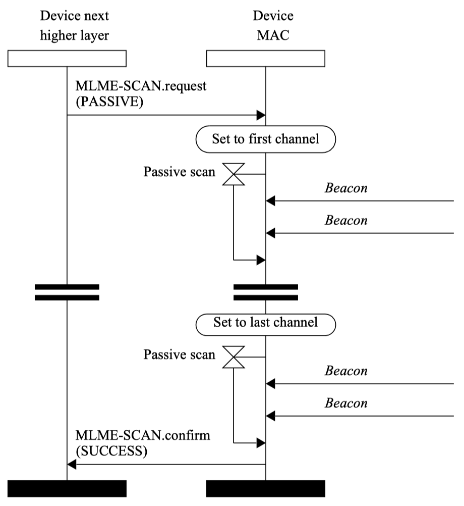
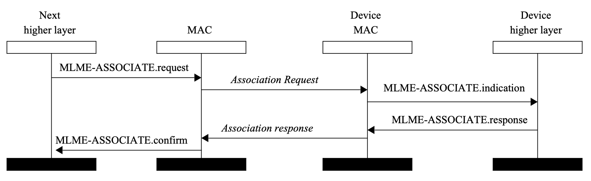
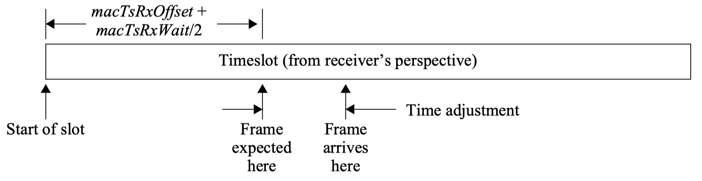
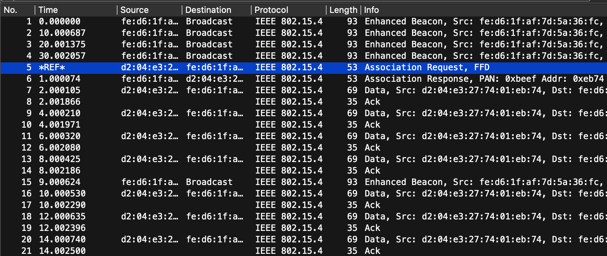
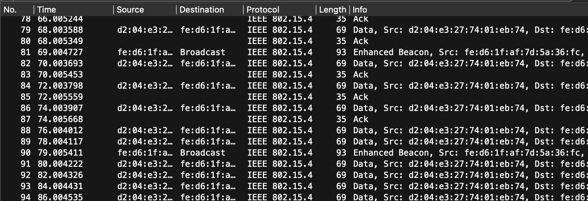
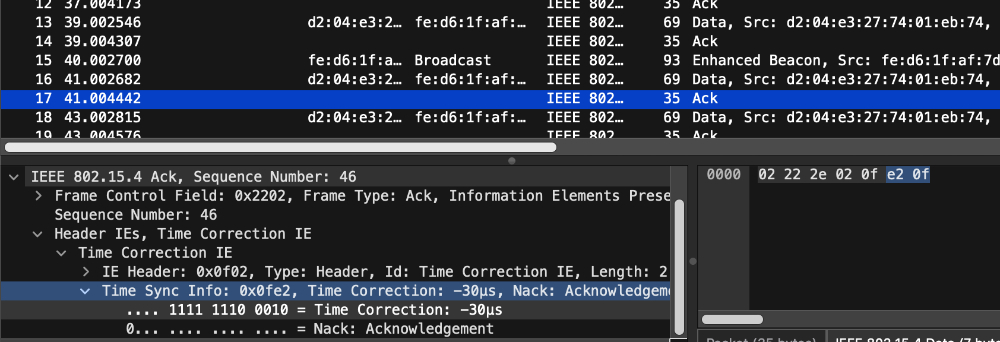
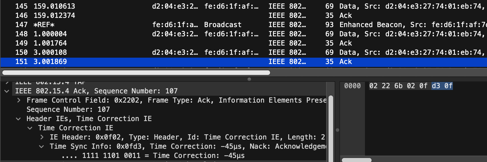
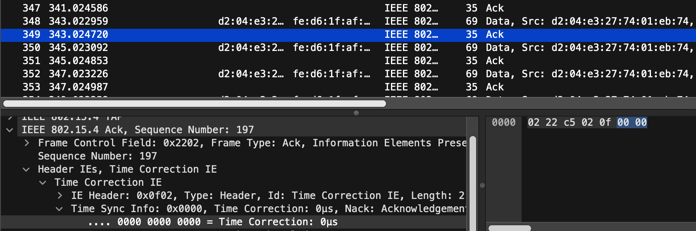

# TSCH-rs: an NLnet Project

TSCH-rs is a TSCH implementation written in Rust, providing ease-of-maintenance, security and reliability. Furthermore, the implementation aims to be hardware-agnostic, making it easy to port to different IEEE 802.15.4 based radios. The Rust network stack for IEEE 802.15.4 radios already contains an implementation for 6LoWPAN and RPL. TSCH-rs will be a valuable addition to the Rust based low-power IEEE 802.15.4 network stack.

## Project Components

Contributions are made on two different Rust projects. 

* `dot15d4` :  This will be the IEEE 802.15.4 implementation written in Rust, initiated by Thibaut Vandervelden and available on [Github](https://github.com/thvdveld/dot15d4/tree/main/dot15d4). The library is designed to be used in embedded systems, and is `no_std` by default.
* `Embassy` : This is the [Rust framework](https://github.com/embassy-rs/embassy) for embedded applications that we will use for testing our `dot15d4` implementation on real hardware. It allows for writing safe, correct and energy-efficient embedded code faster, using the Rust programming language, its async facilities, and the Embassy libraries.

# Milestone 3: Channel Scanning, Association and Synchronisation

**Objective** Implement and validate network formation and maintenance.

This document details the implementation work completed for Milestone 3, covering channel scanning and beacon discovery, device association, synchronisation mechanisms, clock drift handling, basic TSCH scheduler operation, stack integration, testing methodology, and hardware validation.

#### Checkpoints

1. Develop the functionality for scanning through channels.
2. Implement the logic for devices to associate
3. Implement synchronisation mechanisms
4. Implement the mechanism to handle clock drift and re-synchronisation.
5. Basic scheduler implementation: implement the minimal scheduler:
One slotframe and one active timeslot are common for all the nodes in the network.
6. Integrate with the rest of the stack and validate the message transmission/reception
7. Validate channel scanning, association, and synchronisation through unit and integration.
8. Validate on real devices


#### Cloning the project and its dependencies

To test our implementation and read the contributions made, you can recursively clone this repository :

 ```sh
 git clone --recursive https://github.com/jeremydub/TSCH-rs-milestones.git
 cd milestone3
 ```

 This will result in downloading the main dependency at a specific commit, created for this milestone.

## 1. Scanning through channels

### 1.1 Standard Procedure

Before a device can join a TSCH network, it must first discover nearby PAN coordinators by performing a channel scan. The IEEE 802.15.4-2024 standard defines several scan types; our implementation focuses on the passive scan procedure which shall be supported.

During a passive scan, the device sequentially listens on a subset of channels in the 2.4 GHz band without transmitting. On each channel, the device enables its receiver for a configurable duration and waits for incoming Enhanced Beacons. Any Enhanced Beacon received during the scan window is recorded as a PAN descriptor containing the beacon frame, a reception timestamp, and a link quality indicator. The sequence is shown in the following figure :

<p align="center" width="100%">
    
</p>

Once the scan completes, the upper layer receives a list of discovered PAN descriptors. The upper layer then selects the best candidate network to join by evaluating the beacons' TSCH Information Elements, in particular the TSCH Synchronisation IE which contains the join metric. The candidate with the lowest join metric is preferred, as it indicates a shorter hop distance to the network root.

After selecting a beacon, the device extracts the TSCH schedule from its Information Elements (slotframes, links, ASN, timeslot timings) and replays it locally via `MLME-SET-SLOTFRAME`, `MLME-SET-LINK`, and `MLME-SET` requests. The device then switches to TSCH mode by issuing an `MLME-TSCH-MODE` request.


### 1.2 Implementation

#### 1.2.1 MLME Primitive

The `MLME-SCAN` primitive is implemented as a state-machine task within the MAC service. The upper layer submits a `ScanRequest` containing the scan type, the set of channels to scan, and a scan duration exponent. The MAC service creates a `ScanRequestTask` that drives the scan procedure through the following states:

- `Initial` : The task sends a `StartScanning` command to the scheduler, requesting a transition to scanning mode.
- `WaitingForScanStart` : The task waits for the scheduler to confirm that it has switched to scanning mode.
- `ScanningChannel` : The task requests beacon reception from the scheduler. When an Enhanced Beacon is received, it is stored as a `PanDescriptor` in the result list. The task then sends a `StopScanning` command.
- On termination, the task returns a `ScanConfirm` containing the list of discovered PAN descriptors and a status code (`Success`, `NoBeacon`, `LimitReached`, etc.).

Each `PanDescriptor` holds the received MPDU (containing the Enhanced Beacon), the reception timestamp, and the link quality indicator, providing all the information the upper layer needs to select a network and synchronise.

**Location:** `dot15d4/src/mac/mlme/scan.rs`

#### 1.2.2 Scheduler Scan

To support channel scanning, we introduced a top-level scheduler architecture that manages the scheduler lifecycle. The `RootSchedulerTask` wraps the active scheduler implementation and handles transitions between operating modes:

- **CSMA mode** (`UsingCsma`) : Default mode for contention-based access.
- **Scanning mode** (`ScanningChannels`) : Dedicated scanning state for beacon discovery.
- **TSCH mode** (`UsingTsch`) : Time-slotted channel hopping for deterministic operation.

When the MAC layer issues a `StartScanning` command, the CSMA scheduler completes its current activity, transitions to idle, and the root scheduler switches to the `ScanningChannels` state. The `ScanTask` then takes over radio control.

A key feature of the scanning state is its frame filtering logic. It inspects each received frame and only accepts Enhanced Beacons. All other frame types, including data frames, are silently discarded, and it immediately resumes listening:

**Location:**
- `dot15d4/src/scheduler/task.rs` : Root scheduler task and mode switching
- `dot15d4/src/scheduler/scan.rs` : `ScanTask`, `ScanChannels`, frame validation

#### 1.2.3 Usage

The following code shows how the upper layer initiates a passive scan and processes the results:

**Scanning:**

```rust
// Allocating request token for MLME-SCAN.request
let request_token = request_sender.allocate_request_token().await;
let mac_request = MacRequest::MlmeScan(ScanRequest {
    scan_type: ScanType::Passive,
    scan_channels: ScanChannels::All,
    scan_duration: 12,
});

// Response contains PAN descriptors of detected PANs
let scan_confirm = request_sender
    .send_request_awaiting_response(request_token, mac_request)
    .await;
match response {
    MacConfirm::MlmeScan(scan_confirm) => {
        // Selecting best PAN from scan and join the network. 
        join_network_from_scan(request_sender, scan_confirm, buffer_allocator).await
    }
    _ => unreachable!(),
}
```

The `MLME-SCAN.request` is submitted to the MAC service. The async call blocks until the scan completes and returns a `ScanConfirm`. The upper layer then selects the best candidate by comparing join metrics.

Once the best candidate is selected, the device extracts the TSCH schedule from the beacon's Information Elements and replays it locally. The procedure mirrors the PAN coordinator initialisation from Milestone 2, but with parameters extracted from the received beacon instead of being configured statically:

```rust
async fn join_network_from_beacon(...) {
    // Access to Information Elements in MPDU
    let ies = mpdu_parser.ies_fields();

    // 1. Extract and add slotframes and links from the beacon
    let sf_links_ie = ies.tsch_slotframe_link();
    for slotframe in sf_links_ie.slotframes() {
        // MLME-SET-SLOTFRAME.request
        let mac_request = MacRequest::MlmeSetSlotframe(SetSlotframeRequest {
            handle: slotframe.handle() as u16,
            operation: TschScheduleOperation::Add,
            size: slotframe.size(),
            advertise: true,
        });
        request_sender.send_request_awaiting_response(...).await;

        // MLME-SET-LINK.request for each link in the slotframe
        for link in slotframe.links() {
            let mac_request = MacRequest::MlmeSetLink(SetLinkRequest {
                slotframe_handle: slotframe.handle() as u16,
                channel_offset: link.channel_offset(),
                timeslot: link.timeslot(),
                link_options: TschLinkOption::from_bits(link.options()).unwrap(),
                link_type: TschLinkType::Advertising,
                neighbor: None,
                advertise: true,
            });
            request_sender.send_request_awaiting_response(...).await;
        }
    }

    // 2. Synchronize ASN and timing from the beacon
    let asn = ies.tsch_sync().unwrap().asn();
    let mac_request = MacRequest::MlmeSet(SetRequest::new(
        SetRequestAttribute::MacAsn(asn, rx_timestamp),
    ));
    request_sender.send_request_awaiting_response(...).await;

    // 3. Switch to TSCH mode
    let mac_request = MacRequest::MlmeTschMode(TschModeRequest {
        tsch_mode: true,
        tsch_cca: false,
    });
    request_sender.send_request_awaiting_response(...).await;
}
```

This sequence ensures that the joining device has the same slotframe structure, link assignments, and ASN reference as the coordinator, enabling it to participate in the TSCH schedule immediately after joining.

---

## 2. Device Association

### 2.1 Standard Procedure

After a device has scanned the network and synchronised its TSCH schedule, it may optionally perform an association procedure to formally join the PAN. The IEEE 802.15.4-2024 standard defines the association process as an exchange of MAC command frames between the associating device and the PAN coordinator : 

<p align="center" width="100%">
    
</p>

The procedure involves two roles:

**Associating device** (initiates the association):
1. The upper layer issues an `MLME-ASSOCIATE.request` specifying the coordinator's extended address, the PAN ID (from selected Enhanced Beacon used for joining), and the device's capability information.
2. The MAC layer constructs an Association Request command frame (command identifier `0x01`) containing the device's capability information, and transmits it to the coordinator.
3. The device waits for an Association Response command frame (command identifier `0x02`) from the coordinator.
4. Upon reception, the MAC layer delivers an `MLME-ASSOCIATE.confirm` to the upper layer, containing the assigned short address and the association status.

**PAN Coordinator** (handles the association):
1. The coordinator's MAC layer continuously listens for incoming Association Request command frames.
2. When an Association Request is received, the coordinator parses the device's extended address and capability information.
3. The coordinator derives a short address for the device (currently from the last two bytes of the extended address) and constructs an Association Response command frame.
4. The Association Response is transmitted back to the requesting device with the assigned short address and a success status.

### 2.2 Implementation

#### 2.2.1 MLME Primitive

The association primitive is implemented as two complementary MAC tasks: `AssociateRequestTask` for the device side and `AssociateIndicationTask` for the coordinator side.

**Device side : `AssociateRequestTask`:**

The task is a state machine with three states:

- `Initial` : Constructs the Association Request command frame using the `associate_request_frame` builder from the `dot15d4-frame` crate. The frame includes the device's capability information and is submitted for transmission to the scheduler.
- `SendingRequest` : Waits for the transmission result. On success (`Sent`), transitions to waiting for a response. On failure (`NoAck` or `ChannelAccessFailure`), terminates with the corresponding error.
- `WaitingForResponse` : Requests reception of a MAC command of type `AssociateResponse` from the scheduler. Upon reception, parses the response payload to extract the assigned short address and the association status, and terminates with an `AssociateConfirm`.

The `AssociateRequest` and `AssociateConfirm` structures are:

```rust
pub struct AssociateRequest {
    pub coord_address: [u8; 8],
    pub pan_id: u16,
    pub capability: CapabilityInformation,
}

pub enum AssociateConfirm {
    Completed {
        status: AssociationStatus,
        short_address: ShortAddress,
    },
    NoAck,
    ChannelAccessFailure,
}
```

**Coordinator side : `AssociateIndicationTask`:**

This task runs as a background indication task in the MAC service, continuously listening for incoming Association Requests. Its state machine has three states:

- `Initial` : Requests reception of MAC command frames of type `AssociateRequest` from the scheduler.
- `WaitingForRequest` : Upon receiving an Association Request, the task extracts the device's extended address and capability information. It then derives a short address and constructs an Association Response command frame using the `associate_response_frame` builder. If the frame is invalid, the task resumes listening.
- `SendingResponse` : Transmits the Association Response. Regardless of the transmission outcome (success, no acknowledgment, or channel access failure), the task resumes listening for the next association request.

The coordinator delivers an `AssociateIndication` to the upper layer:

```rust
pub struct AssociateIndication {
    pub device_address: [u8; 8],
    pub capability_information: CapabilityInformation,
    pub assigned_short_address: [u8; 2],
}
```

**Location:**
- `dot15d4/src/mac/mlme/associate.rs` : `AssociateRequestTask`, `AssociateIndicationTask`, request/confirm/indication types
- `dot15d4-frame/src/mpdu/command.rs` : `associate_request_frame`, `associate_response_frame`, `CapabilityInformation`, `AssociationStatus`
- `dot15d4/src/utils.rs` : MAC command frame routing (`process_rx_frame`)

#### 2.2.2 Usage

The upper layer initiates an association by submitting an `MLME-ASSOCIATE.request` to the MAC service:

```rust
// Allocating MLME-ASSOCIATE.request
let request_token = request_sender.allocate_request_token().await;
let mac_request = MacRequest::MlmeAssociate(AssociateRequest::new(
    [0xfe, 0xd6, 0x1f, 0xaf, 0x7d, 0x5a, 0x36, 0xfc], // Coordinator extended address
    0xBEEF,                                               // PAN ID
    CapabilityInformation::default(),
));
// Sending request and wait for response
let response = request_sender
    .send_request_awaiting_response(request_token, mac_request)
    .await;

// Inspecting response
match response {
    MacConfirm::MlmeAssociate(AssociateConfirm::Completed { status, short_address }) => {
        if status == AssociationStatus::Successful {
            let addr_bytes = short_address.as_ref();
            let short_addr_u16 = u16::from_le_bytes([addr_bytes[0], addr_bytes[1]]);
            info!("Associated with short address: {:04X}", short_addr_u16);

            // Configure the assigned short address via MLME-SET
            let request_token = request_sender.allocate_request_token().await;
            let mac_request = MacRequest::MlmeSet(SetRequest::new(
                SetRequestAttribute::MacShortAddress(short_addr_u16),
            ));
            request_sender
                .send_request_awaiting_response(request_token, mac_request)
                .await;
        }
    }
    MacConfirm::MlmeAssociate(AssociateConfirm::NoAck) => {
        info!("Association request not acknowledged");
    }
    MacConfirm::MlmeAssociate(AssociateConfirm::ChannelAccessFailure) => {
        info!("Association failed: channel access failure");
    }
    _ => unreachable!(),
}
```

On the coordinator side, no explicit call is needed: the `AssociateIndicationTask` is automatically created as a background task by the MAC service when the `tsch` feature is enabled. When a device's association request arrives, the coordinator processes it, sends the response, and delivers the indication to the upper layer via the `MacIndication::MlmeAssociateIndication` channel.

---

## 3. Synchronisation mechanisms

### 3.1 Standard Procedure

The IEEE 802.15.4-2024 standard (Section 10.3.5.3) defines two synchronisation mechanisms that allow TSCH devices to maintain accurate timing alignment with the network:

**Acknowledgment-based synchronisation:** When a device receives an Enhanced Acknowledgment in response to a data frame it transmitted, the Enh-ack may contain a Time Correction IE in its header. This IE carries a signed time correction value (in microseconds) that indicates how much the receiver's clock has drifted relative to the sender's clock. The transmitting device uses this value to adjust its own timing reference, keeping the two nodes synchronised without requiring additional beacon frames.

**Frame-based synchronisation:** When a device receives a frame (such as an Enhanced Beacon) from a time source neighbor, it can compute the expected arrival time of the frame based on the ASN and the timeslot timing template. The difference between the expected and actual reception timestamps reveal the clock drift between the two devices. The receiving device adjusts its base time accordingly, as shown in the following figure : 

<p align="center" width="100%">
    
</p>

### 3.2 Implementation

#### 3.2.1 Frame-based synchronisation

Frame-based synchronisation is implemented in the TSCH scheduler's `execute_receiving` state handler. When a device receives a frame (such as an Enhanced Beacon) from its time source neighbor, the scheduler calls `TschPib::sync_asn()` to re-align its local timing reference. The method computes the timeslot start time by subtracting the `macTsTxOffset` from the received frame's RMARKER timestamp, then updates both the current ASN and `last_base_time` accordingly. This effectively corrects any accumulated drift by anchoring the device's schedule to the actual reception time.

This mechanism is gated behind the `no-tsch-frame-sync` compile-time feature flag: when the feature is not enabled (the default), frame-based synchronisation is active. Enabling the feature disables it, which is useful for testing and validating, as we'll do later in this document.

**Location:**
- `dot15d4/src/scheduler/tsch/logic.rs` : `execute_receiving()`
- `dot15d4/src/scheduler/tsch/pib.rs` : `TschPib::sync_asn()` : base time correction from RMARKER timestamp

#### 3.2.2 Acknowledgment-based synchronisation

Acknowledgment-based synchronisation is implemented in the TSCH scheduler's `execute_transmitting` state handler. 

On the transmitting side, upon receiving a `Sent` event from the driver service, the scheduler extracts the `timesync_us` value from the Enhanced Acknowledgment's Time Correction IE. If the value is negative (the transmitter's clock is ahead), the device adds the correction to its `last_base_time`; if positive (the transmitter's clock is behind), it subtracts the correction. This direct adjustment to the base time ensures the device's schedule stays aligned with the coordinator.

On the receiving side (coordinator), the driver service computes the time correction when constructing the Enhanced Acknowledgment. It compares the expected frame start time (`expected_rx_framestart`, derived from `macTsTxOffset`) with the actual RMARKER reception timestamp and writes the delta into the Time Correction IE of the outgoing Enhanced Ack.

This mechanism is gated behind the `no-tsch-ack-sync` compile-time feature flag: when the feature is not enabled (the default), acknowledgment-based synchronisation is active.

**Location:**
- `dot15d4/src/scheduler/tsch/logic.rs` : `execute_transmitting()` : base time adjustment from Time Correction IE (line 153)
- `dot15d4/src/driver.rs` : Enhanced Ack construction with Time Correction IE computation (see function `complete_reception_with_ack`)

---

## 4. Clock drift handling

Clock drift is an inherent challenge in TSCH networks. Each node's crystal oscillator runs at a slightly different frequency, causing their timing references to diverge over time. If left uncorrected, this drift causes nodes to miss their scheduled timeslots, leading to eventual desynchronisation.

The IEEE 802.15.4-2024 standard partly addresses clock drift by defining guard times to mitigate the problem at the cost of higher energy consumption due to longer than necessary RX periods. The TSCH timeslot timing template includes a guard time parameter that defines how early a receiver should start listening before the expected frame arrival. This guard time absorbs minor clock drift between consecutive communications. In our implementation, we use the default guard times values.

Beyond the guard times, our implementation provides an active **drift compensation** mechanism that estimates and predicts the clock drift between a device and its time source neighbor. The drift estimation is performed by the `TschPib::update_drift()` method. Each time the device synchronises with its time source (via frame-based synchronisation through `sync_asn()`), it records the timeslot start time and the corresponding ASN. On subsequent synchronisation events, the method computes the elapsed time between the two synchronisation points and compares it with the expected elapsed time (based on the number of slots elapsed multiplied by the nominal timeslot duration). The difference, divided by the number of elapsed slots, yields the per-slot drift in nanoseconds, stored as `drift_ns`.

Once estimated, the drift is applied predictively in `TschPib::expected_slot_start()`. Instead of using the normal timeslot duration for scheduling future timeslots, the method adjusts the slot duration by subtracting the estimated drift. This allows the scheduler to anticipate the clock drift and place its TX/RX windows more accurately, reducing the probability of missed slots between synchronisation events.

Two independent compile-time feature flags control this behaviour:
- `no-tsch-drift-compensation` : When enabled, disables the drift estimation logic (`update_drift()` is not called). The `drift_ns` value remains at zero.
- `no-tsch-drift-adjustment` : When enabled, disables the application of the estimated drift to slot timing. The scheduler uses the nominal timeslot duration even if `drift_ns` has been computed.

These flags allow testing each component in isolation: one can estimate drift without applying it, or disable estimation entirely while still using the standard synchronisation mechanisms.

**Location:**
- `dot15d4/src/scheduler/tsch/pib.rs` : `TschPib::update_drift()` : drift estimation from consecutive synchronisation points
- `dot15d4/src/scheduler/tsch/pib.rs` : `TschPib::expected_slot_start()` : drift-adjusted timeslot scheduling

---

## 5. Basic Scheduler Implementation

### 5.1 Scheduler Logic


The TSCH scheduler is the core component responsible for executing the TSCH schedule. It manages a queue of **pending operations**, i.e. time-bound actions (transmission, reception, or advertisement) that are scheduled to occur at specific Absolute Slot Number (ASN).

The scheduler's main loop operates as follows:

1. The scheduler starts in **Idle** state and waits for either a new TX request from the MAC layer or a timer expiration signalling that the next pending operation's deadline has arrived.
2. When a TX request arrives, the scheduler finds the next appropriate link (based on frame type), computes the corresponding ASN and channel, and creates a `TschOperation` that is inserted into the pending operations queue.
3. The pending operations queue is sorted by ASN in descending order (earliest ASN at the end) for efficient `pop()`. When multiple operations target the same ASN, a priority-based conflict resolution is applied: TX-type operations (both `TxSlot` and `AdvertisementSlot`) take precedence over `RxSlot` operations, and when two operations of the same direction collide, the one with the lower `slotframe_handle` wins.
4. Before each timeslot, the scheduler wakes up early by a configurable **guard time** (2000 µs) to account for clock drift and radio preparation time.
5. When the deadline expires, the scheduler pops the next operation and computes the precise radio instant by adding the appropriate offset (`macTsTxOffset` for TX, `macTsRxOffset` for RX) to the timeslot's base time.
6. The scheduler computes the physical channel using the TSCH channel hopping formula: `channel = hopping_sequence[(ASN + channel_offset) % hopping_sequence_length]`.
7. For beacon (advertisement) operations, the scheduler updates the pre-allocated Enhanced Beacon buffer with the current ASN before submitting it for transmission.
8. The scheduler submits the operation as a driver request (TX or RX) with precise timing, and transitions to the corresponding state (`WaitingForTxStart`, `Listening`) to await driver events.

The TSCH operations are defined as:

```rust
pub enum TschOperation {
    TxSlot { mpdu: MpduFrame, asn: TschAsn, channel: Channel, cca: bool, response_token: ResponseToken },
    RxSlot { asn: TschAsn, channel: Channel },
    AdvertisementSlot { asn: TschAsn, channel: Channel },
    Idle,
}
```

**Link selection** for incoming TX requests is performed by `TschPib::select_next_link()`, which iterates over all links across all slotframes and returns the one with the earliest upcoming ASN that matches the requested criteria (TX capability, advertising type, etc.). When two links from different slotframes collide on the same ASN, the link with the lower `slotframe_handle` takes precedence, as specified by IEEE 802.15.4-2024.

**Location:**
- `dot15d4/src/scheduler/tsch/logic.rs` : TSCH scheduler state machine and running loop
- `dot15d4/src/scheduler/tsch/task.rs` : `TschTask`, `TschOperation`, pending operations queue
- `dot15d4/src/scheduler/tsch/pib.rs` : `TschPib`, schedule management, link selection, ASN computation

### 5.2 As a TSCH PAN Coordinator

When operating as a PAN coordinator, the TSCH scheduler provides basic network communication capabilities by maintaining a shared advertising link that all nodes in the network can use.

The coordinator's scheduler is initialised via `init_coordinator()`, which:
1. Sets the device as coordinator.
2. Configures periodic beacon advertisement with a configurable period.
3. Allocates and builds an initial Enhanced Beacon frame from the current schedule.
4. Schedules the first beacon transmission by finding the next advertising link in the schedule.

Periodic beacon scheduling is managed by the `BeaconConfig` structure. The scheduler calls `schedule_next_beacon()` to find the next advertising link after the minimum beacon interval and queue an `AdvertisementSlot` operation.

After a beacon is transmitted, the scheduler records the transmission time, recovers the beacon frame buffer for reuse, and schedules the next beacon. This cycle ensures that Enhanced Beacons are periodically transmitted on advertising links, enabling new devices to discover and join the network.

Additionally, the coordinator handles incoming MAC command frames (such as Association Requests). A single shared link configured at timeslot 0 with options `TX | RX | Shared | TimeKeeping` provides a minimal but functional communication channel for all nodes in the network.

### 5.3 As a TSCH device

After a device joins a network via scanning (Section 1) and optionally associates (Section 2), the TSCH scheduler initialises in device mode via `init_device()`.

The device scheduler operates with the same TSCH schedule that was extracted from the coordinator's Enhanced Beacon. During the join procedure, the upper layer replayed the beacon's slotframe and link Information Elements as `MLME-SET-SLOTFRAME` and `MLME-SET-LINK` requests, populating the device's `TschPib` with an identical schedule. The ASN and base time were synchronised via `MLME-SET` with the `MacAsn` attribute and the beacon's reception timestamp.

Once in TSCH mode, the device scheduler:
1. Calls `init_device()` which disables beacon transmission if not coordinator and immediately schedules the next RX operation on the closest available RX link.
2. Enters the same main loop as the coordinator: waiting for TX requests or timer expirations, and executing pending operations at their scheduled times.
3. For data transmission, the upper layer submits `MCPS-DATA.request` primitives. The scheduler finds the next TX link, computes the ASN and channel, and queues the operation. It may replace an already scheduled RX operation with lower priority.
4. For reception, the scheduler proactively schedules RX operations by calling `schedule_next_rx()` after each completed reception, ensuring continuous listening on shared links.

## 6. Integrate with the rest of the stack and validate the message transmission/reception

### 6.1 Layered Architecture

Our implementation follows a layered architecture that ensures clean separation of concerns: the upper layer does not need any knowledge of lower-layer implementation details, and vice versa. Services communicate through strongly-typed async channels, providing zero-copy message passing where possible.

The network stack consists of four core services:
- **Radio Driver** (`dot15d4-driver`): Hardware abstraction over the physical radio peripheral, exposing a behaviorally-typed state machine interface.
- **Driver Service** (`dot15d4/src/driver.rs`): Manages the radio driver lifecycle, handles radio state transitions, automatic acknowledgment transmission/reception, and inter-frame spacing requirements.
- **Scheduler Service** (`dot15d4/src/scheduler/`): Implements medium access control scheduling (CSMA-CA and TSCH), operating purely in terms of MPDUs and scheduling policies.
- **MAC Service** (`dot15d4/src/mac/`): Implements IEEE 802.15.4 MAC layer primitives (MCPS and MLME services), providing the interface used by upper-layer protocols and applications.

### 6.2 Embassy Integration

The `dot15d4` stack is designed to run on top of the [Embassy](https://github.com/embassy-rs/embassy) async runtime for embedded Rust. Embassy provides cooperative multitasking through Rust's async/await facilities, which maps naturally to our service architecture: each service runs as an independent Embassy task, communicating through async channels.

The application instantiates all four service layers as concurrent Embassy tasks:
1. `driver_service_task` : Radio hardware management
2. `scheduler_service_task` : TSCH scheduling (or CSMA-CA)
3. `mac_service_task` : MAC Service for MAC requests handling
4. `upper_layer_task` : Application logic (PAN coordinator or joining device)

Each task is spawned via `embassy_executor::Spawner` and runs independently. The channels between services are backed by `static_cell::StaticCell` allocations to satisfy Embassy's `'static` lifetime requirements without dynamic allocation.

Our current implementation provides a "raw" approach for upper-layer data packets: the upper layer constructs MPDU frames directly and submits them via `MCPS-DATA.request` primitives. We do not yet handle upper-layer protocols such as IPv6, RPL routing, or 6LoWPAN adaptation.

Integration with smoltcp, the `no_std` TCP/IP stack used by Embassy, is a planned future step but was not prioritised here. The primary difficulty lies in the interface mismatch: smoltcp's `embassy-net` integration expects a network driver that provides raw Ethernet-like frame access with immediate send/receive semantics, whereas our TSCH MAC layer operates through an asynchronous request/confirm model with time-slotted access.
Bridging these two paradigms requires an adapter layer that translates between smoltcp's `Device` trait and our MAC service primitives, handling buffering, flow control, and the inherent latency of scheduled transmissions.

### 6.3 Data Transmission Example

The following example shows how the upper layer transmits a data frame over a TSCH link:

```rust
let payload = [1, 2, 3, 4, 5, 6, 7, 8];

// Allocating a frame buffer large enough for our need.
let buffer = buffer_allocator.try_allocate_buffer(BUFFER_SIZE).unwrap();

// Allocating a request token for our MCPS-DATA.request.
let request_token = request_sender.allocate_request_token().await;
let data_request = MacRequest::McpsData(DataRequest {
    mpdu: build_data_frame(buffer, seq_nr, &src_addr, &dst_addr, &payload),
});

// Wait for confirmation of transmission 
// (might return Sent, NoAck, ChannelAccessFailure, ..)
let mac_confirm = request_sender
    .send_request_awaiting_response(request_token, data_request)
    .await;
```

### 6.4 Data Reception Example

```rust
// Allocate Token that guarantees that we'll be able to 
// consume messages from MAC indication channel
let mut consumer_token = mac_indication_receiver
    .try_allocate_consumer_token()
    .unwrap();

loop {
    // Wait for an incoming MAC indication
    let (response_token, mac_indication) = mac_indication_receiver
        .receive_request_async(&mut consumer_token, &())
        .await;
    // Inspect indication. Here, we are only interested in data
    match mac_indication {
        dot15d4::mac::primitives::MacIndication::McpsData(data_indication) => {
            // Process received data frame
            let received_mpdu = data_indication.mpdu;
            #[cfg(any(feature = "log", feature = "defmt"))]
            {
                let timestamp = data_indication.timestamp.ticks();
                info!("Rx Timestamp : {}", timestamp);
            }
            unsafe { buffer_allocator.deallocate_buffer(received_mpdu.into_buffer()) };
            mac_indication_receiver.received(response_token, ());
        }
        _ => unreachable!(),
    }
}
```

The MAC service forwards the frame to the scheduler, which finds the next available TX link in the TSCH schedule, computes the target ASN and channel, and queues the transmission. The driver service then transmits the frame at the precise scheduled instant. Upon completion, the MAC service returns a `McpsData` confirm containing the transmission timestamp.

**File Location:** `examples/nrf52840/src/bin/tsch-node.rs`


## 7. Validate channel scanning, association, and synchronisation through unit and integration.

We designed a synchronous test framework that allows us to test our MAC and scheduler state machines in isolation, without requiring a real radio or async runtime. The core idea is to drive the state machines step-by-step with simulated inputs (events) and verify the outputs (actions and responses) at each transition.

The framework consists of two test runners:

**Scheduler Task Test Runner** (`dot15d4/src/scheduler/tests.rs`)\
Provides infrastructure for testing scheduler task state machines synchronously. The runner includes:
- A `FakeRadioTimer` with controllable time for deterministic timing tests
- A `DeterministicRng` that returns pre-configured values for reproducible backoff behaviour
- A `TestRunner` that wraps a scheduler task, steps it through events, and captures detailed introspection on driver requests (TX/RX parameters, timestamps, channels), actions, responses, and deadlines
- Frame creation helpers for building test MPDUs and radio frames
- Static channel allocations for scheduler requests and driver events

**MAC Task Test Runner** (`dot15d4/src/mac/tests.rs`)\
Provides infrastructure for testing MAC task state machines. The runner includes:
- A `MacTaskTestRunner` that wraps a MAC task, steps it with events (Entry, SchedulerResponse), and returns `MacStepOutcome` (Pending with scheduler request, or Terminated with result)
- Request classification helpers to assert on the type of scheduler request produced
- Response builder functions to simulate scheduler replies (Sent, NoAck, ChannelAccessFailure, Beacon reception, MAC command reception)
- Buffer tracking for automatic cleanup on test completion

We implemented close to 100 tests that cover the various features of the TSCH scheduler, scanning, association, and synchronisation mechanisms.

### 7.1 Channel Scanning

**Location:** `dot15d4/src/mac/mlme/scan.rs`\
**Number of tests:** 8

### 7.2 Association

**Location:** `dot15d4/src/mac/mlme/associate.rs`\
**Number of tests:** 14

Device-side `AssociateRequestTask` : 8 tests

Coordinator-side `AssociateIndicationTask` (6 tests):

### 7.3 Synchronisation

#### 7.3.1 Frame-based synchronisation

**Location:** `dot15d4/src/scheduler/tsch/tests.rs` (`frame_sync_tests` module)\
**Number of tests:** 3

#### 7.3.2 Acknowledgment-based synchronisation

**Location:** `dot15d4/src/scheduler/tsch/tests.rs` (`ack_sync_tests` module)\
**Number of tests:** 5

#### 7.3.3 Clock-drift handling

**Location:** `dot15d4/src/scheduler/tsch/tests.rs` (`clock_drift_tests` module)\
**Number of tests:** 12

### 7.4 TSCH Scheduler

**Location:** `dot15d4/src/scheduler/tsch/tests.rs`\
**Number of tests:** 75

The TSCH scheduler tests cover:

* State & initialisation
* Timing & ASN computation
* Beacon configuration
* TX operations
* RX operations
* Advertisement
* Deadline management
* Command handling

### 7.5 Running Tests
```bash
# Navigate to Milestone 3 folder
cd milestone-3/

# Go into dot15d4 project
cd dot15d4/

# Run all tests in the dot15d4 crate
cargo test --package dot15d4 --lib --features tsch-node,std -- --test-threads=1
```

---

## 8. Hardware Validation

The `tsch-node.rs` example application demonstrates end-to-end TSCH network formation, device scanning, association, and bidirectional data exchange on real hardware (Nordic nRF52840).

**File Location:** `examples/nrf52840/src/bin/tsch-node.rs`

### 8.1 Application Purpose

The example application supports multiple roles through compile-time environment variables:

* **PAN Coordinator** (`COORDINATOR=1`): \
Configures the device as a TSCH coordinator by creating a TSCH schedule with a single slotframe of size 100 and a shared link at timeslot 0 with `TX | RX | Shared | TimeKeeping` options. The coordinator periodically transmits Enhanced Beacons and listens for incoming data packets ( while implicitly listen for Association Requests).

* **Joining Device** (default): \
Performs a passive scan, selects the best candidate network by comparing join metrics, extracts the TSCH schedule from the beacon's Information Elements, then performs association with the coordinator to obtain a short address.

* **Sender** (`SENDER=1`): After joining and associating (or starting a PAN), the device periodically transmits data frames to the coordinator, demonstrating end-to-end data exchange over TSCH links.

### 8.2 Validation

To validate our channel scanning, association, and synchronisation implementation on real hardware, we run the `tsch-node` example on two Nordic nRF52840 devices and capture radio frames using a Wireshark sniffer. A third nRF52840 device is configured as a sniffer using the Nordic nRF Sniffer for 802.15.4 firmware.

The captured radio traces will allow us to verify that:
- Enhanced Beacons are transmitted periodically by the coordinator.
- The passive scan procedure discovers the coordinator and the device joins the TSCH network.
- The Association Request / Response exchange completes successfully with proper timeslot alignment.
- Data frames are transmitted and acknowledged within the correct TSCH timeslots.
- Synchronisation mechanisms (frame-based and acknowledgment-based) correct clock drift as expected.
- Drift compensation predicts and eliminates clock drift between synchronisation events.

We demonstrate four scenarios with progressively more synchronisation mechanisms enabled, showing the effect of each mechanism.

### 8.3 Firmware Generation

**Compiling/flashing the firmware:**

```bash
# Go to dot15d4 project folder
cd milestone-3/dot15d4

# Go to examples for nRF52840
cd examples/nrf52840

# Build/Flash PAN coordinator (and select a 1st device)
COORDINATOR=1 cargo embed --bin tsch-node --release --features defmt,tsch-node flash

# Build/Flash joining device (sender) (and select a 2nd device)
SENDER=1 cargo embed --bin tsch-node --release --features defmt,tsch flash
```

**Connect to the debug interface (for each device):**

```bash
cargo embed --bin tsch-node --release --features defmt,tsch rtt
```

**Radio trace:**

To observe the radio traffic, you need a sniffer device. You can follow the instructions for the Nordic Sniffer for nRF52840 to configure it as a Wireshark sniffer :

- [nRF Sniffer for 802.15.4 Firmware](https://github.com/NordicSemiconductor/nRF-Sniffer-for-802.15.4)

---

### Scenario 1 : No synchronisation mechanisms

**Objective:** Demonstrate baseline TSCH operation without any clock drift correction, and observe how long the network remains functional before desynchronisation. This scenario also serves to validate the scan, association and data exchange sequence.

**Configuration:** All three synchronisation and drift-handling features are disabled on the joining device, so neither frame-based sync, acknowledgment-based sync, nor drift adjustment are active. The device relies solely on the initial synchronisation obtained during the join procedure.

**Compiling the joining device for Scenario 1:**

```bash
SENDER=1 cargo embed --bin tsch-node --release \
  --features defmt,tsch,no-tsch-ack-sync,no-tsch-frame-sync,no-tsch-drift-adjustment \
  flash
```

The coordinator is compiled normally as described in Section 8.3.

**Observations from radio trace:**

We recorded a radio trace using Wireshark, as partially shown in figure below. The capture (and figure) shows the following sequence of events:

<p align="center" width="100%">
    
</p>

1. **Coordinator beacons:** The coordinator periodically transmits Enhanced Beacons on the shared advertising link (timeslot 0, channel offset 0). Each beacon contains the current ASN in the TSCH Synchronisation IE and the slotframe/link schedule in the TSCH Slotframe and Link IE.

2. **Passive scan:** The joining device starts and begins listening for beacons. After receiving an Enhanced Beacon, it extracts the TSCH schedule and synchronises its ASN and base time.

3. **Association Request:** The device transmits an Association Request MAC command to the coordinator in the correct timeslot (timeslot 0 of the next slotframe cycle). The coordinator acknowledges reception with an Enhanced Ack.

4. **Association Response:** One slotframe cycle later (100 timeslots), the coordinator responds with an Association Response containing the assigned short address.

5. **Data exchange:** The associated device begins transmitting data packets every 2 seconds on the shared link. The coordinator acknowledges each data frame with an Enhanced Ack. We observe that frames are correctly aligned within TSCH timeslots.

6. **Desynchronisation:** After approximately **74 seconds**, the coordinator stops acknowledging the device's data frames, as shown in the figure below. At this point, the accumulated clock drift has exceeded the guard time window (`macTsRxWait / 2 = 1100 µs`). \
We can estimate that the device, from its perspective, "drifts away" from coordinator by approximately `1100µs / 74sec = +-15 µs` per second.

<p align="center" width="100%">
    
</p>

This confirms that without any synchronisation mechanisms for that pair of devices with their own imperfect clocks, the network desynchronises within about 74 seconds, and seems to show that the clock drift between the two devices is approximately +-15 µs/s.

**Radio trace Location** : [/milestone3/scenario1.pcapng](/milestone3/scenario1.pcapng)\
**Radio trace duration** : 500 seconds

### Scenario 2 : Acknowledgment-based synchronisation only

**Objective:** Validate that acknowledgment-based synchronisation alone prevents desynchronisation. We also verify that the Time Correction IE values match the drift estimated in Scenario 1, and observe that drift accumulates between synchronisation points since drift compensation is disabled.

**Configuration:** Only acknowledgment-based synchronisation is enabled. Frame-based synchronisation and drift adjustment are disabled. The device corrects its base time each time it receives an Enhanced Ack with a Time Correction IE, but does not compensate/predict drift between corrections.

**Compiling the joining device for Scenario 2:**

```bash
SENDER=1 cargo embed --bin tsch-node --release \
  --features defmt,tsch,no-tsch-frame-sync,no-tsch-drift-adjustment \
  flash
```

**Observations from radio trace:**

<p align="center" width="100%">
    
</p>

The Wireshark capture reveals the content of the Enhanced Acks sent by the coordinator. Each Enhanced Ack contains a Time Correction IE with a time synchronisation value of approximately **30 µs**, as shown in figure above. This is consistent with the drift estimated in Scenario 1 since data packets are sent every 2 seconds, i.e. drift accumulated for 2 seconds is 30µs, so 15µs per second.

The time correction value remains stable across successive acknowledgments (consistently around 30 µs) because the device corrects its base time upon each Enhanced Ack reception. The drift then accumulates again over the next 2-second interval until the next data exchange, resulting in the same correction value each time.

Most importantly, the device **does not desynchronise** after 74 seconds. The periodic base time corrections from the Time Correction IE are sufficient to keep the device within the coordinator's guard time window (if sent within desynchronisation margin), confirming that acknowledgment-based synchronisation works correctly.

**Radio trace Location** : [/milestone3/scenario2.pcapng](/milestone3/scenario2.pcapng)
**Radio trace duration** : 500 seconds

### Scenario 3 : Frame-based synchronisation only

**Objective:** Validate that frame-based synchronisation alone prevents desynchronisation. We observe that the device re-synchronises its timing reference each time it receives a frame from the coordinator (in our scenario, Enhanced Beacons), and that clock drift accumulates between beacon receptions since both acknowledgment-based sync and drift adjustment are disabled.

**Configuration:** Only frame-based synchronisation is enabled. Acknowledgment-based synchronisation and drift adjustment are disabled. The device corrects its base time when it receives any frame from its time source neighbor (here, the periodic Enhanced Beacons from the coordinator).

**Compiling the joining device for Scenario 3:**

```bash
SENDER=1 cargo embed --bin tsch-node --release \
  --features defmt,tsch,no-tsch-ack-sync,no-tsch-drift-adjustment \
  flash
```

**Observations from radio trace:**

<p align="center" width="100%">
    
</p>

The Wireshark capture shows that the device re-synchronises its timing each time it successfully receives a frame from the coordinator. Between frame receptions (here beacons), the clock drift accumulates: the Time Correction IE values in Enhanced Acks (which are still generated by the coordinator even though the device does not use them for synchronisation) show increasing drift values between beacon intervals, then drop back to a low value immediately after a beacon is received and the base time is corrected via `sync_asn()`.

The device **does not desynchronise** after 74 seconds. The periodic beacon receptions provide sufficient synchronisation to keep the device within the guard time window, if sent often which is not ideal in practice. This confirms that frame-based synchronisation independently prevents desynchronisation, provided beacons are received frequently enough relative to the drift rate.

**Radio trace Location** : [/milestone3/scenario3.pcapng](/milestone3/scenario3.pcapng)\
**Radio trace duration** : 500 seconds

### Scenario 4 : Full synchronisation with drift compensation

**Objective:** Validate that with all synchronisation mechanisms and drift compensation enabled, the device achieves near-zero clock-drift (relative to the coordinator). The drift compensation predicts the per-slot clock drift and adjusts the timeslot duration accordingly, so that the device's schedule remains aligned even between synchronisation events.

**Configuration:** All mechanisms are enabled (the default configuration): frame-based synchronisation, acknowledgment-based synchronisation, and drift compensation with drift-adjusted timeslot scheduling. 

**Compiling the joining device for Scenario 4:**

```bash
SENDER=1 cargo embed --bin tsch-node --release --features defmt,tsch flash
```

**Observations from radio trace:**

<p align="center" width="100%">
    
</p>

The Wireshark capture shows that the Time Correction IE values in Enhanced Acks are approximately **0 µs**, as shown in the figure above. This is in stark contrast with Scenario 2, where the values were consistently around 30 µs. The near-zero correction values demonstrate that the drift compensation mechanism (`update_drift()` and `expected_slot_start()`) accurately estimates the per-slot drift and pre-adjusts the timeslot duration, so that by the time the next data frame is transmitted 2 seconds later.

The device **does not desynchronise** and maintains very low drift over the entire observation period (well beyond the 74-second threshold from Scenario 1). This validates that the combination of all synchronisation mechanisms : frame-based re-synchronisation on beacon reception, acknowledgment-based correction on data exchange, and predictive drift compensation between synchronisation events : provides robust and accurate timing alignment for TSCH operation.

**Radio trace Location** : [/milestone3/scenario4.pcapng](/milestone3/scenario4.pcapng)\
**Radio trace duration** : 500 seconds

# About the project

This project was funded through the NGI0 Core Fund, a fund established by NLnet with financial support from the European Commission's Next Generation Internet programme, under the aegis of DG Communications Networks, Content and Technology under grant agreement No 101092990.
